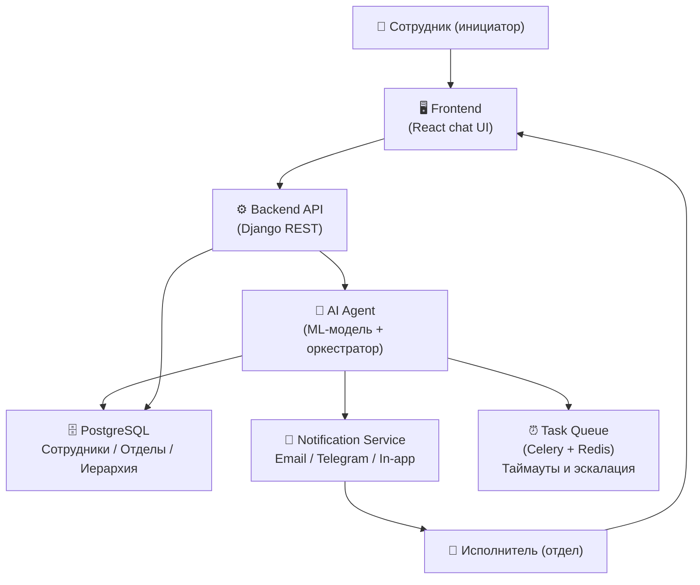
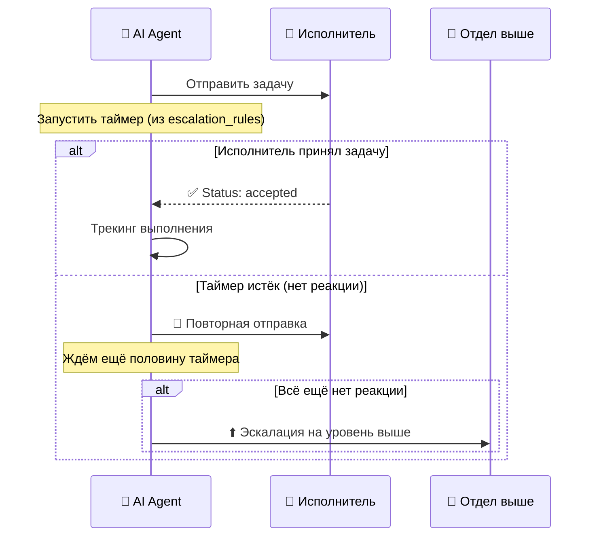

# 🏗️ Архитектура платформы «Вектор»

> **Тема акселератора:** Использование технологий ИИ/нейросетевых технологий машинного обучения в целях оптимизации процесса обработки обращений пользователей

---

## 📌 Суть проекта

Диалоговая платформа (чат-интерфейс), в которой сотрудник описывает свою проблему текстом. ИИ-агент:
1. **Понимает** суть обращения (категория, срочность)
2. **Находит** нужный отдел и исполнителя на основе данных из БД
3. **Отправляет** задачу и отслеживает реакцию
4. **Эскалирует** по иерархии, если нет ответа — автоматически

---

## 🧩 Компоненты системы



---

## 🗄️ Модель базы данных (PostgreSQL)

### Ключевые таблицы

| Таблица | Ключевые поля | Назначение |
|---|---|---|
| `employees` | id, name, role, department_id, is_head | Список сотрудников |
| `departments` | id, name, parent_id | Отделы + иерархия (дерево) |
| `categories` | id, name, keywords (из ии - в таблице оставляем пустыми), default_department_id | Типы обращений |
| `tickets` | id, text, category_id, priority, status, created_at, author_id, assigned_to | Обращения |
| `ticket_assignments` | ticket_id, employee_id, department_id, assigned_at, accepted_at, escalated | Трекинг назначения |
| `escalation_rules` | category_id, timeout_minutes | Правила таймаута |

### Иерархия отделов (пример)
```
Предприятие
└── Цех №1
    ├── Электрики
    │   ├── Электрик Иванов
    │   └── Электрик Петров (head)
    └── Сантехники
        └── ...
└── ИТ-отдел
    └── ...
```
`parent_id` у каждого отдела позволяет двигаться по иерархии вверх при эскалации.

---

## 🤖 ИИ-агент: логика работы

### Шаг 1 — Классификация обращения
- Модель (fine-tuned на типовых заявках) определяет:
  - **Категорию** (электрика, сантехника, ИТ...)
  - **Приоритет**: `low / medium / high / critical`
- Входные данные: текст обращения + метаданные (цех отправителя)

### Шаг 2 — Выбор исполнителя

```
if priority == critical:
    → отправить ВСЕМ сотрудникам нужного отдела + руководителю
elif priority == high:
    → отправить руководителю отдела
else:
    → выбрать свободного сотрудника (round-robin или по нагрузке)
```

### Шаг 3 — Отправка и ожидание подтверждения



### Шаг 4 — Завершение
- Исполнитель отмечает задачу как выполненную
- Агент закрывает тикет, уведомляет инициатора
- Данные идут в аналитику

---

## 🖥️ Frontend (React)

### Экраны

| Экран | Описание |
|---|---|
| **Чат-интерфейс** | Диалоговое окно — ввод обращения текстом |
| **Дашборд сотрудника** | Мои активные задачи, принять/отклонить |
| **Дашборд руководителя** | Все задачи отдела, статусы, эскалации |
| **Панель администратора** | Управление сотрудниками, отделами, правилами |
| **Аналитика** | Графики загрузки, время ответа, типы обращений |

### Ключевые компоненты
- `ChatWidget` — диалог с агентом
- `TicketCard` — карточка задачи (принять / отклонить / выполнено)
- `HierarchyTree` — визуализация структуры отделов
- `EscalationTimeline` — трекинг пути обращения

---

## ⚙️ Backend (Django)

### API эндпоинты

| Метод | URL | Назначение |
|---|---|---|
| POST | `/api/tickets/` | Создать обращение |
| GET | `/api/tickets/{id}/` | Статус тикета |
| PATCH | `/api/tickets/{id}/accept/` | Принять задачу |
| PATCH | `/api/tickets/{id}/complete/` | Завершить задачу |
| GET | `/api/departments/tree/` | Иерархия отделов |
| GET | `/api/employees/` | Список сотрудников |
| POST | `/api/agent/classify/` | Запрос к AI-агенту |

### Фоновые задачи (Celery)
- `check_ticket_timeout` — проверять каждые N минут, нет ли просроченных тикетов
- `send_notification` — отправка уведомлений (email / telegram)
- `escalate_ticket` — переслать тикет выше по иерархии

---

## 🧠 ML-часть

### Задачи модели
1. **Классификация категории** — multi-class classification по тексту обращения
2. **Определение приоритета** — regression / classification (low/medium/high/critical)
3. **(опционально) Извлечение сущностей** — цех, оборудование, ключевые слова

### Подход
- **Базовая модель:** предоставленная организаторами (BERT-подобная или GPT-подобная)
- **Fine-tuning** на датасете типовых заявок + размеченных исторических обращениях
- **Dataset:** типовые заявки из `templates`, можно дополнить открытыми датасетами по service desk / ITSM
- **API:** модель оборачивается в FastAPI-сервис, который вызывает Django-бэкенд

### Схема ML-пайплайна
```
Текст обращения
    → Предобработка (очистка, нормализация)
    → Базовая модель (эмбеддинги)
    → Голова классификации (категория)
    → Голова классификации (приоритет)
    → JSON-ответ: { category, priority, confidence }
```

---

## 🔔 Сервис уведомлений

- **In-app:** уведомление в интерфейсе (WebSocket / SSE)
- **Email:** для высокоприоритетных задач
- **Telegram-бот (опционально):** быстрая реакция прямо в мессенджере

---

## 👥 Роли команды и зоны ответственности

| Участник | Роль | Зона работы |
|---|---|---|
| **Артём** | Дизайн | UI/UX: wireframes, дизайн-система, Figma |
| **Максим + Никита** | База данных | Схема PostgreSQL, наполнение данными, миграции |
| **Максим + Лёня** | Frontend | React-приложение, компоненты, интеграция с API |
| **Андрей + Настя** | ML | Обучение модели, API FastAPI, пайплайн классификации |
| **Настя + Захар + Андрей** | Backend | Django REST, Celery, логика эскалации, эндпоинты |
| **Сеня + Тигран** | Аналитика | Исследование задачи, презентация, метрики |

### Порядок старта работ

```
Неделя 1: БД (схема) → Backend (базовые модели и API) → Design (wireframes)
Неделя 2: ML (базовый классификатор) → Frontend (чат-интерфейс) → Backend (эскалация)
Неделя 3: Интеграция всего → Тестирование → Аналитика + Презентация
```

---

## ✅ Минимально жизнеспособный прототип (MVP)

Для демонстрации на акселераторе достаточно:

- [ ] Чат-интерфейс: ввод обращения текстом
- [ ] ИИ определяет категорию и приоритет
- [ ] Система находит нужный отдел и исполнителя
- [ ] Исполнитель видит задачу и может её принять
- [ ] Таймаут + эскалация на уровень выше (хотя бы 1 уровень)
- [ ] Инициатор видит статус своего обращения

---

## 🔑 Ключевые технические решения

| Решение | Выбор | Причина |
|---|---|---|
| БД | PostgreSQL | Поддержка рекурсивных запросов (CTE) для обхода иерархии |
| Иерархия | `parent_id` (Adjacency List) | Простота, легко понять, легко запросить через рекурсивный CTE |
| Очередь задач | Celery + Redis | Таймауты и фоновая эскалация |
| ML serving | FastAPI | Лёгкий, быстрый, отдельный сервис |
| Реалтайм | WebSocket (Django Channels) | Уведомления без перезагрузки страницы |
| Frontend | React + Axios | Команда знакома, быстрый старт |
